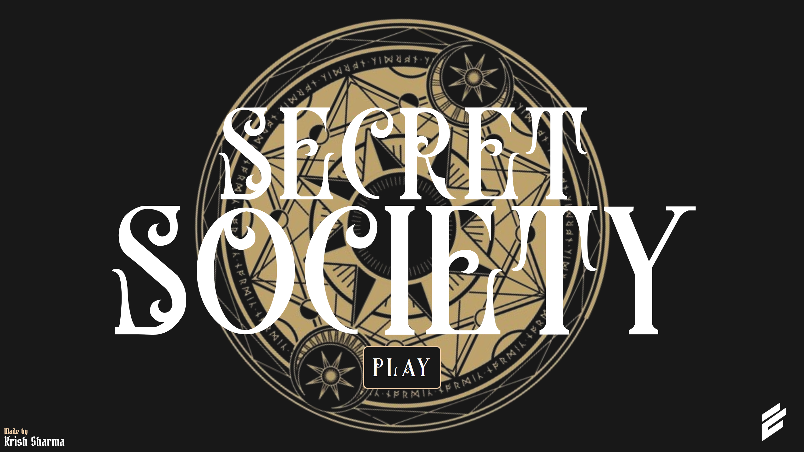
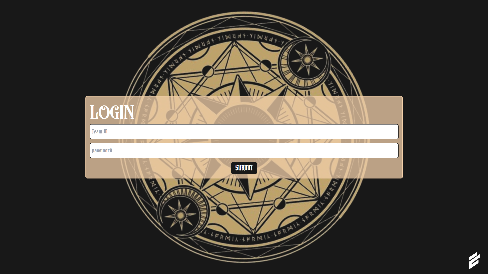
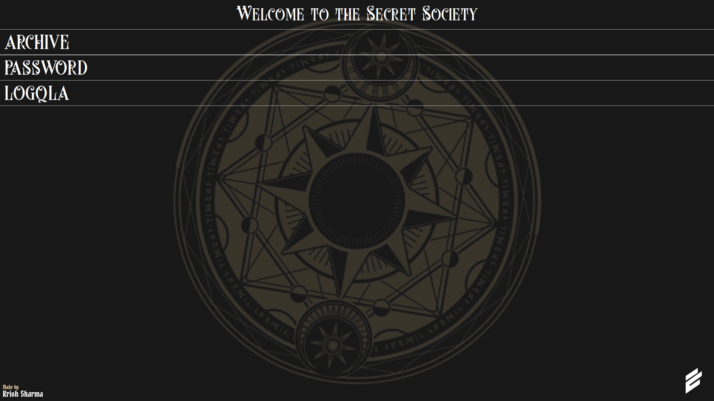
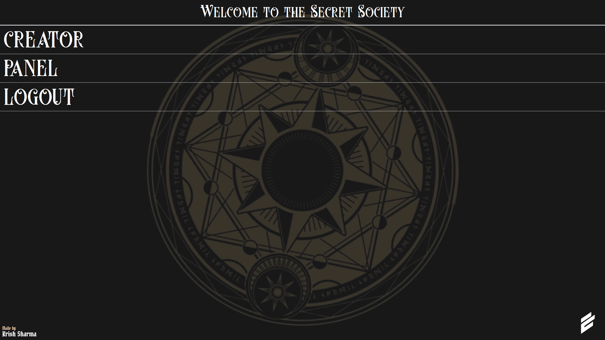
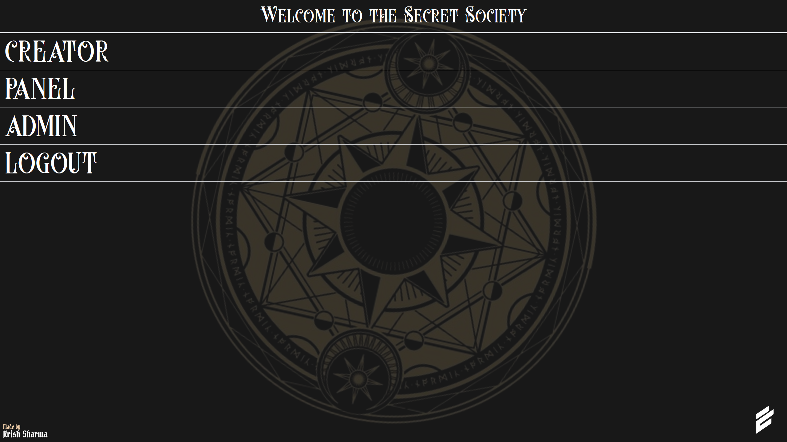

# [ELICIT] Secret Society
MUJ ACM's Elicit RTE event: Secret Society, an offline in-person treasure hunt. The website was created for scanning QRs and to prevent cheaters from cheating or participants from scanning random QRs and going out of their own story.

PWA was also available for better experience.

## Database Schema
MongoDB had the following collections.
- `users`: To save all users data.
- `scanned`: To save all the timestamps at which the user scanned to detect cheating afterwards.

### users
```json
{
    "_id": "acm001",
    "lastscanned": "askjdh2378eh", 
    "password": "some_password",
    "admin": false,
    "token": "jwt token",
}
```

### Scanned
```json
{
    "id": "acm001",
    "qr": "askjdh2378eh",
    "time": 238947612784
}
```

### JWT token payload
```json
{
    "_id": "acm001",
    "admin": false,
}
```

## Screenshots

## Main page
The participants were greeted with.


### Login page


### Participants Dashboard
To access `archive` which shows past scanned QRs as well as `password` to change account password.


### Admin Dashboard
To access `creator` panel to create new particpants accounts for walk-in registrations as well as a `panel` that shows the progress of teams with their timestamps.


### Superadmin Dashboard
Admin dashboard + access to `admin` panel to create admin accounts.

